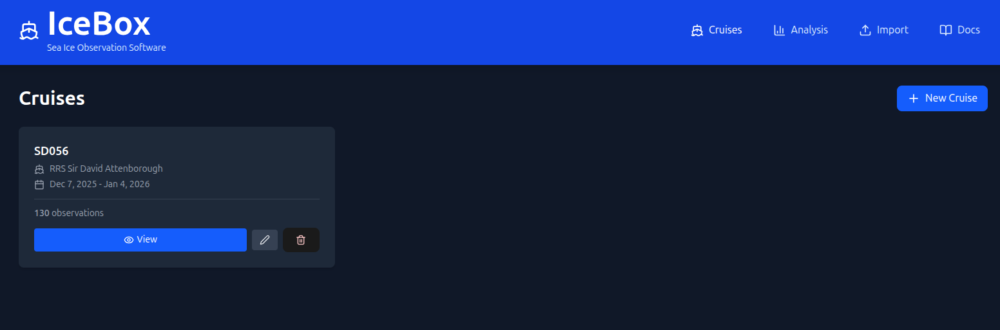
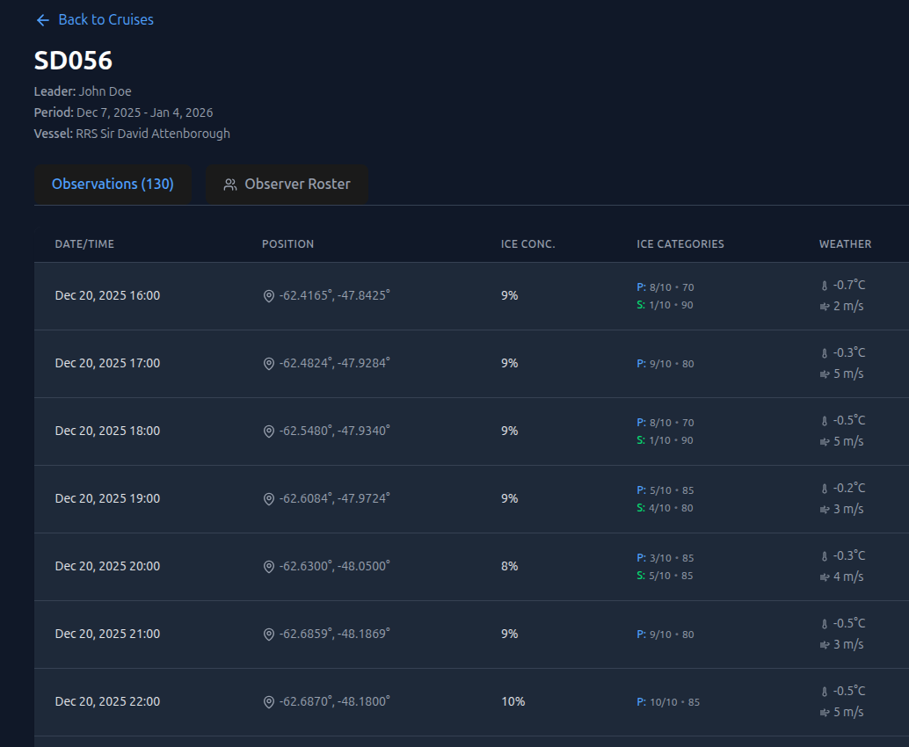
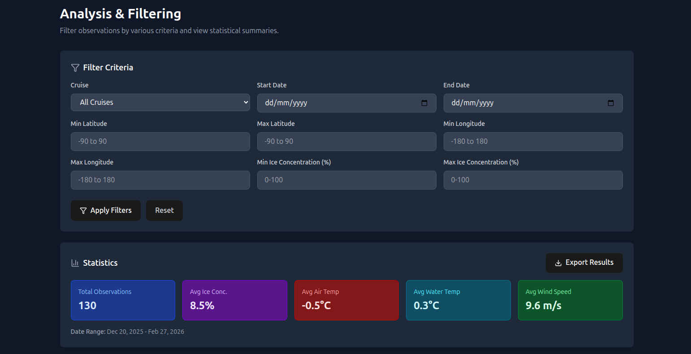
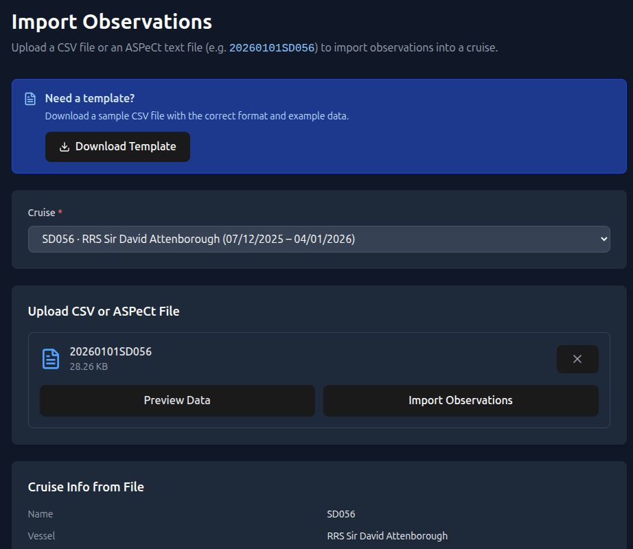

# IceBox

[](https://github.com/antarctica/icebox/releases)
[](LICENSE)
[](https://react.dev)
[](https://www.typescriptlang.org)
[](https://vitejs.dev)

IceBox 2.0.0 is a modernisation and refactor of [IceBox v1.8.3](https://aws.data.aad.gov.au/aspect/), the [Antarctic Sea Ice Processes and Climate (ASPeCt)](https://aspectsouth.org/) observation software for collecting and analysing sea ice data during research cruises.

Please refer to the [ASPeCt Sea-Ice cards](https://aspectsouth.org/wp-content/uploads/2024/06/sea-ice-cards_LOGODOI.pdf) for guidelines on classifying sea ice and recording data.

## Overview

This application enables researchers to:
- Record sea ice observations with coordinates
- Track meteorological data (temperature, wind, cloud cover)
- Document ice conditions and concentrations
- Analyse and filter observation data
- Export data in CSV and ASPECT formats
- Import bulk observations from CSV files

Originally developed by the Australian Antarctic Division (AAD), this is a refactoring by the British Antarctic Survey (BAS) using modern web technologies while preserving all original functionality.

## Screenshots

### Cruise List


### Observations


### Analysis & Filtering


### Import


## Quick Start

```bash
# Install dependencies
npm install

# Start development server
npm run dev
```

Visit **http://localhost:5173/** to use the application.

## Development

### Available Scripts

```bash
# Development server with HMR
npm run dev

# Type checking
npm run build

# Linting
npm run lint

# Preview production build
npm run preview
```

### Building for Production

```bash
npm run build
```

Output is in the `dist/` directory, ready for static hosting or Electron packaging.

## Configuration

### TypeScript
- Strict mode enabled for maximum type safety
- Separate configs for app code (`tsconfig.app.json`) and Node tooling (`tsconfig.node.json`)

### ESLint
- Flat config format (ESLint 9+)
- React hooks rules enabled
- TypeScript-aware linting

### Tailwind CSS
- Custom configuration in `tailwind.config.js`
- PostCSS processing with `@tailwindcss/postcss` plugin
- Modern `@import "tailwindcss"` syntax (v4)

### IndexedDB

All data is stored locally in **IndexedDB** via Dexie.js:
- Works offline, no server required
- Data persists across browser sessions
- Full CRUD operations with TypeScript type safety
- Database schema includes **Cruises** and **Observations**

## Data Model

### Cruise
| Field | Type | Required | Description |
|---|---|---|---|
| `uuid` | string | Yes | Unique identifier |
| `name` | string | Yes | Cruise name |
| `voyage_leader` | string | Yes | Name of the voyage leader |
| `captain_name` | string | Yes | Name of the captain |
| `start_date` / `end_date` | Date | Yes | Cruise date range |
| `voyage_vessel` | string | No | Vessel name |
| `voyage_ice_rating` | string | No | Ice class rating of the vessel |
| `rostered_persons` | RosteredPerson[] | No | Observer roster with hourly assignments |
| `measurement_reference` | string | No | Reference point for measurements |

### Observation
| Field | Type | Required | Description |
|---|---|---|---|
| `uuid` | string | Yes | Unique identifier |
| `cruise` | string | Yes | FK to Cruise |
| `entry_datetime` | Date | Yes | UTC timestamp of the observation |
| `latitude` / `longitude` | number | Yes | GPS position |
| `total_ice_concentration` | number | No | Total concentration (tenths, 0–10) |
| `open_water_type` | string | No | Open water type code |
| `primary_ice` | IceObservation | No | Primary ice category |
| `secondary_ice` | IceObservation | No | Secondary ice category |
| `tertiary_ice` | IceObservation | No | Tertiary ice category |
| `air_temp` / `water_temp` | number | No | Temperatures in °C |
| `wind_speed` | number | No | Wind speed in m/s |
| `wind_direction` | number | No | Wind direction in degrees (0–360) |
| `cloud_cover` | number | No | Cloud cover in oktas (0–8) |
| `visibility` | string | No | Visibility category |
| `weather` | string | No | Weather description |
| `observer` | string | No | Observer name |
| `comments` | string | No | Free-text notes |

### IceObservation (per category)
| Field | Type | Required | Description |
|---|---|---|---|
| `ice_concentration` | number | Yes | Concentration in tenths (0–10) |
| `ice_type` | string | Yes | ASPeCt ice type code (e.g. `FY`, `MY`) |
| `ice_thickness` | string | Yes | Thickness code or range |
| `floe_size` | string | Yes | Floe size code (e.g. `S`, `M`, `G`) |
| `topography` | string | Yes | Topography code (e.g. `R3`, `H1`) |
| `snow_type` | string | No | Snow type code |
| `snow_thickness` | string | No | Snow thickness code |
| `brown_ice` | string | No | Brown ice indicator |
| `melt_pond_coverage` | number | No | Melt pond areal coverage (%) |
| `melt_pond_depth` | number | No | Melt pond depth (m) |
| `melt_pond_length_1/2` | number | No | Melt pond dimensions (m) |


## Credits

For IceBox v2.0.0 onwards:

* **Author**: British Antarctic Survey
* **Developer**: Thomas Zwagerman

This is a refactor of the original IceBox v1.8.4. For all version up to v1.8.4:

* **Original Application**: ASPeCt IceBox  
* **Original Author**: Australian Antarctic Division  
* **Original Developer**: James Rakich (Maluco Marinero)  
* **Original Repository**: https://bitbucket.org/MalucoMarinero/aspect

## License

See LICENSE file for details.
